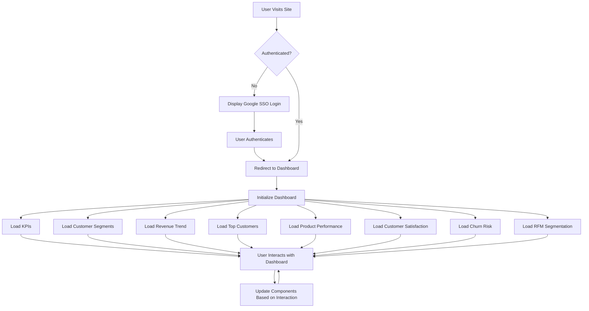

# Customer Data Platform (CDP) Application Design Document

## Page 1: Project Overview and Authentication

### Project Name and Heading

**Project Name: E-Commerce Insights CDP**

*Empowering data-driven decisions through comprehensive customer insights*

### Google SSO Authentication

The E-Commerce Insights CDP will implement Google SSO authentication using the @react-oauth/google library. This process will ensure secure and seamless user access while maintaining data privacy.

Authentication Flow:
1. User clicks "Sign in with Google" button
2. Google OAuth consent screen appears
3. User grants permission
4. Application receives OAuth token
5. Backend verifies token and creates a session

Error Handling:
- Invalid token: Redirect to error page with "Authentication failed" message
- Network issues: Display retry option with error message

Security Considerations:
- Implement HTTPS
- Store tokens securely using HttpOnly cookies
- Implement token refresh mechanism

Authentication Interface:
- Minimalist design with Google SSO button
- Empty input fields for email and password (for future non-SSO options)
- Clear error messages and loading indicators

## Page 2: Dashboard Design and Components

### Dashboard Layout and Structure

The dashboard will utilize a responsive 12-column grid system to ensure optimal viewing across devices. The layout will consist of:

1. Header (1 row, 12 columns):
   - Logo (2 columns)
   - Navigation menu (8 columns)
   - User profile/settings (2 columns)

2. Main Content Area (10 rows, 12 columns):
   - Sidebar for filters (2 columns)
   - Dashboard components (10 columns)

3. Footer (1 row, 12 columns):
   - Copyright information
   - Quick links

The main navigation will include:
- Dashboard (default view)
- Customer Profiles
- Segmentation
- Campaigns
- Analytics

### Key Dashboard Components and API Mapping

#### a. Key Performance Indicators (KPIs)

Visual: Four card-style components displaying key metrics
Data Source: customer_360 table
API Endpoint: `/kpis`
Update Frequency: Real-time
Interactivity: Hover for detailed information, click to drill down

```json
{
  "total_customers": 10000,
  "total_revenue": 1500000,
  "avg_customer_value": 150,
  "active_customers_percentage": 75
}
```

#### b. Customer Segment Distribution (Pie Chart)

Visual: Interactive pie chart
Data Source: customer_360.customer_segment
API Endpoint: `/customer_segments`
Update Frequency: Daily
Interactivity: Click to filter other components, hover for segment details

```json
{
  "segments": [
    {"name": "High Value", "value": 2000},
    {"name": "Medium Value", "value": 5000},
    {"name": "Low Value", "value": 3000}
  ]
}
```

#### c. Monthly Revenue Trend (Line Chart)

Visual: Line chart with option to compare year-over-year
Data Source: Aggregated from customer_360.total_spend
API Endpoint: `/monthly_revenue`
Update Frequency: Monthly
Interactivity: Zoom, pan, toggle year comparison

```json
{
  "months": ["Jan", "Feb", "Mar", ...],
  "current_year": [100000, 120000, 110000, ...],
  "previous_year": [90000, 100000, 95000, ...]
}
```

#### d. Top 5 Customers by Lifetime Value (Table)

Visual: Sortable table with customer details
Data Source: customer_360 table
API Endpoint: `/top_customers`
Update Frequency: Daily
Interactivity: Sort columns, click for detailed customer profile

```json
{
  "top_customers": [
    {
      "customer_id": 1001,
      "name": "John Doe",
      "lifetime_value": 5000,
      "total_purchases": 50
    },
    // ... more customers
  ]
}
```

#### e. Product Category Performance (Bar Chart)

Visual: Horizontal bar chart
Data Source: Aggregated from customer_360.favorite_category
API Endpoint: `/product_category_performance`
Update Frequency: Weekly
Interactivity: Sort bars, click to filter other components

```json
{
  "categories": [
    {"name": "Electronics", "revenue": 500000, "units_sold": 1000},
    {"name": "Clothing", "revenue": 300000, "units_sold": 2000},
    // ... more categories
  ]
}
```

#### f. Customer Satisfaction Score (Gauge Chart)

Visual: Gauge chart with color-coded zones
Data Source: customer_360.avg_satisfaction_score
API Endpoint: `/customer_satisfaction`
Update Frequency: Real-time
Interactivity: Hover for detailed breakdown

```json
{
  "overall_score": 4.2,
  "breakdown": {
    "product_quality": 4.5,
    "customer_service": 4.0,
    "delivery_speed": 4.1
  }
}
```

#### g. Churn Risk Distribution (Pie Chart)

Visual: Pie chart with drill-down capability
Data Source: customer_360.customer_status
API Endpoint: `/churn_risk`
Update Frequency: Daily
Interactivity: Click to view customer list, hover for percentage

```json
{
  "churn_risk": [
    {"status": "Low Risk", "count": 6000},
    {"status": "Medium Risk", "count": 3000},
    {"status": "High Risk", "count": 1000}
  ]
}
```

#### h. RFM Segmentation (Scatter Plot)

Visual: 3D scatter plot (Recency, Frequency, Monetary)
Data Source: Calculated from customer_360 table
API Endpoint: `/rfm_segmentation`
Update Frequency: Weekly
Interactivity: Rotate, zoom, select clusters

```json
{
  "segments": [
    {
      "name": "Best Customers",
      "recency": 5,
      "frequency": 4,
      "monetary": 5,
      "count": 1000
    },
    // ... more segments
  ]
}
```

### Dashboard Interactivity and User Experience

1. Global Filtering:
   - Date range selector affecting all components
   - Customer segment filter
   - Search bar for finding specific customers

2. Cross-component Data Linking:
   - Clicking on a segment in the Customer Segment Distribution chart filters data in other components
   - Selecting a product category highlights related customer data

3. Customization Options:
   - Drag-and-drop interface for rearranging dashboard components
   - Option to save custom dashboard layouts
   - Ability to create custom metrics and add them to the dashboard

## Page 3: Architecture Visualization and Technical Considerations

### Sankey Diagram Implementation using Plotly

The Sankey diagram will be implemented using Plotly.js to visualize the data flow in our CDP application. This diagram will help developers and stakeholders understand how data moves through the system.

Implementation Steps:
1. Prepare data in the required format for Plotly Sankey diagram
2. Create a Plotly.js Sankey trace
3. Set up the layout and config options
4. Render the diagram in a responsive container

Data Flow Representation:
- Nodes represent data sources, temporary tables, and the final customer_360 table
- Links show the flow of data between these nodes
- Link thickness represents the volume of data flowing between nodes

Styling Guidelines:
- Use a color scheme that matches the overall application design
- Ensure sufficient contrast between nodes and links
- Use consistent node sizes for each level of data processing

Interactivity Features:
- Hover over nodes to highlight connected links
- Click on nodes to view detailed information about the data source or table
- Implement zooming and panning for large diagrams

Example Plotly.js code for Sankey diagram:

```javascript
const data = [{
  type: "sankey",
  orientation: "h",
  node: {
    pad: 15,
    thickness: 30,
    line: { color: "black", width: 0.5 },
    label: ["customer_info", "purchase_transactions", "product_catalog", "customer_service", "campaign_responses", "website_behavior", "temp_customer_basic", "temp_purchase_stats", "temp_product_preferences", "temp_customer_service_stats", "temp_campaign_engagement", "temp_website_behavior", "customer_360"],
    color: ["#a6cee3", "#1f78b4", "#b2df8a", "#33a02c", "#fb9a99", "#e31a1c", "#fdbf6f", "#ff7f00", "#cab2d6", "#6a3d9a", "#ffff99", "#b15928", "#8dd3c7"]
  },
  link: {
    source: [0, 1, 1, 2, 3, 4, 5, 6, 7, 8, 9, 10, 11],
    target: [6, 7, 8, 8, 9, 10, 11, 12, 12, 12, 12, 12, 12],
    value: [1, 1, 1, 1, 1, 1, 1, 1, 1, 1, 1, 1, 1]
  }
}];

const layout = {
  title: "CDP Data Flow",
  font: { size: 10 }
};

Plotly.newPlot('sankey-container', data, layout);
```

### Data Integration and Performance

To ensure efficient data loading and state management:
1. Implement server-side pagination for large datasets
2. Use React Query for efficient data fetching and caching
3. Implement debouncing for search and filter operations

Caching Mechanisms:
- Use browser's localStorage for user preferences and non-sensitive data
- Implement Redis on the backend for frequently accessed data

Error Handling:
- Display user-friendly error messages
- Implement retry mechanisms for failed API calls
- Provide fallback UI components for data loading errors

### Responsive Design and Cross-platform Considerations

Breakpoints:
- Mobile: < 768px
- Tablet: 768px - 1024px
- Desktop: > 1024px

Layout Adjustments:
- Stack components vertically on mobile
- Use a 2-column layout on tablets
- Full 12-column grid on desktop

Progressive Enhancement:
- Implement core functionality for all devices
- Add advanced interactive features for desktop users
- Use responsive images and lazy loading for improved performance on mobile devices

## Page 4: Website Flow and API Integration

### Website Flow



### API Integration

The dashboard integrates with backend APIs using the following endpoints:

1. `/kpis`: Fetches overall KPIs
2. `/customer_segments`: Retrieves customer segment distribution
3. `/monthly_revenue`: Gets monthly revenue trend data
4. `/top_customers`: Fetches top 5 customers by lifetime value
5. `/product_category_performance`: Retrieves product category performance data
6. `/customer_satisfaction`: Gets overall customer satisfaction score
7. `/churn_risk`: Fetches churn risk distribution
8. `/rfm_segmentation`: Retrieves RFM segmentation data

Data fetching strategy:
1. Use React Query for efficient data fetching and caching
2. Implement error boundaries for each component
3. Display loading skeletons during data fetch

Error handling:
- Retry failed requests automatically (up to 3 times)
- Display user-friendly error messages
- Provide option to manually retry failed requests

Data transformations:
- Perform any necessary data formatting on the backend
- Use utility functions for common transformations (e.g., date formatting)

### Data Refresh and Real-time Updates

Strategies for keeping dashboard data current:
1. Implement polling for non-critical data (e.g., every 5 minutes)
2. Use WebSockets for real-time updates on critical metrics (e.g., KPIs)
3. Allow manual refresh option for all components

Real-time update implementation:
1. Set up a WebSocket connection on dashboard initialization
2. Listen for specific events (e.g., 'kpi_update', 'new_customer')
3. Update relevant components when events are received

```javascript
const socket = new WebSocket('wss://api.ecommerce-insights-cdp.com/ws');

socket.onmessage = (event) => {
  const data = JSON.parse(event.data);
  switch(data.type) {
    case 'kpi_update':
      updateKPIComponent(data.payload);
      break;
    case 'new_customer':
      updateCustomerSegments(data.payload);
      break;
    // Handle other event types
  }
};
```

By following this design document, UI developers will have a clear understanding of the CDP application's structure, functionality, and data integration requirements. The document provides practical guidance for implementation while adhering to best practices in UI/UX design for data-intensive applications.# Customer Compass 360 Backend API Documentation

## Overview

This document provides detailed information about the backend API for the Customer Compass 360 application. The API is built using FastAPI and provides various endpoints to retrieve customer data, performance metrics, and visualizations.

## Base URL

The base URL for all API endpoints will depend on your deployment environment. Replace `{BASE_URL}` in the endpoint URLs with the appropriate base URL for your deployment.

## Authentication

Currently, the API does not implement authentication. If required, authentication mechanisms should be added before deploying to a production environment.

## Endpoints

### 1. Root

- **URL:** `{BASE_URL}/`
- **Method:** GET
- **Description:** Provides a welcome message for the API.
- **Response:**
  ```json
  {
    "message": "Welcome to the CDP Dashboard API"
  }
  ```

### 2. Key Performance Indicators (KPIs)

- **URL:** `{BASE_URL}/kpis`
- **Method:** GET
- **Description:** Retrieves key performance indicators for the business.
- **Response:** JSON object containing:
  - `total_customers`: Integer representing the total number of customers
  - `total_lifetime_value`: Float representing the total lifetime value of all customers
  - `average_order_value`: Float representing the average order value of all customers
  - `retention_rate`: Float representing the retention rate of all customers (percentage)
- **Example Response:**
  ```json
  {
    "total_customers": 10000,
    "total_lifetime_value": 5000000.50,
    "average_order_value": 150.75,
    "retention_rate": 85.5
  }
  ```

### 3. Customer Segments

- **URL:** `{BASE_URL}/customer_segments`
- **Method:** GET
- **Description:** Retrieves customer segment distribution data.
- **Response:** JSON object representing a pie chart of customer segment distribution.
- **Note:** The response is a Plotly figure JSON that can be used to render a chart on the frontend.

### 4. Monthly Revenue

- **URL:** `{BASE_URL}/monthly_revenue`
- **Method:** GET
- **Description:** Retrieves monthly revenue trend data.
- **Response:** JSON object representing a line chart of monthly revenue trend.
- **Note:** The response is a Plotly figure JSON that can be used to render a chart on the frontend.

### 5. Top Customers

- **URL:** `{BASE_URL}/top_customers`
- **Method:** GET
- **Description:** Retrieves the top 5 customers by total lifetime value.
- **Response:** JSON array of objects, each containing:
  - `customer_id`: String representing the customer's unique identifier
  - `first_name`: String representing the customer's first name
  - `last_name`: String representing the customer's last name
  - `total_lifetime_value`: Float representing the customer's total lifetime value
- **Example Response:**
  ```json
  [
    {
      "customer_id": "C001",
      "first_name": "John",
      "last_name": "Doe",
      "total_lifetime_value": 25000.50
    },
    {
      "customer_id": "C002",
      "first_name": "Jane",
      "last_name": "Smith",
      "total_lifetime_value": 22000.75
    }
  ]
  ```

### 6. Product Category Performance

- **URL:** `{BASE_URL}/product_category_performance`
- **Method:** GET
- **Description:** Retrieves revenue performance data for different product categories.
- **Response:** JSON object representing a bar chart of product category performance.
- **Note:** The response is a Plotly figure JSON that can be used to render a chart on the frontend.

### 7. Customer Satisfaction

- **URL:** `{BASE_URL}/customer_satisfaction`
- **Method:** GET
- **Description:** Retrieves the average customer satisfaction score.
- **Response:** JSON object representing a gauge chart of customer satisfaction score.
- **Note:** The response is a Plotly figure JSON that can be used to render a chart on the frontend.

### 8. Churn Risk

- **URL:** `{BASE_URL}/churn_risk`
- **Method:** GET
- **Description:** Retrieves the distribution of churn risk scores.
- **Response:** JSON object representing a pie chart of churn risk distribution.
- **Note:** The response is a Plotly figure JSON that can be used to render a chart on the frontend.

### 9. RFM Segmentation

- **URL:** `{BASE_URL}/rfm_segmentation`
- **Method:** GET
- **Description:** Retrieves RFM (Recency, Frequency, Monetary) segmentation data.
- **Response:** JSON object representing a 3D scatter plot of RFM segmentation.
- **Note:** The response is a Plotly figure JSON that can be used to render a chart on the frontend.

## Error Handling

All endpoints will return appropriate HTTP status codes:
- 200: Successful request
- 4xx: Client errors (e.g., 404 for not found, 400 for bad request)
- 5xx: Server errors

In case of errors, a JSON object with an "error" key describing the issue will be returned.

Example error response:
```json
{
  "error": "Resource not found"
}
```

## Data Format

All responses are in JSON format. For endpoints returning chart data (customer segments, monthly revenue, product category performance, customer satisfaction, churn risk, and RFM segmentation), the response is a JSON representation of a Plotly figure, which can be directly used to render charts on the frontend.

## Database

The API interacts with an SQLite database named `pg_cdp_demo.db`. This database contains the following tables:
- `customer_360`: Contains comprehensive customer data
- `purchase_transactions`: Contains data about customer purchases
- `product_catalog`: Contains information about products

## Dependencies

The backend relies on the following main Python libraries:
- FastAPI: Web framework for building the API
- SQLite3: Database interaction
- Pandas: Data manipulation and analysis
- Plotly: Generating interactive charts
- Anthropic: For potential AI-powered features (API key required)

## Running the API

To run the API locally:

1. Ensure all dependencies are installed:
   ```
   pip install fastapi uvicorn sqlite3 pandas plotly
   ```

2. Run the FastAPI application using Uvicorn:
   ```
   uvicorn main:app --host 0.0.0.0 --port 8000
   ```

The API will be available at `http://localhost:8000`. You can access the interactive API documentation at `http://localhost:8000/docs`.

## Deployment

For production deployment, consider the following:
- Use a production-grade ASGI server like Gunicorn with Uvicorn workers
- Implement proper authentication and authorization mechanisms
- Use environment variables for sensitive information (e.g., database credentials)
- Consider using a production-ready database system (e.g., PostgreSQL)
- Implement HTTPS for secure communication
- Set up proper logging and monitoring

## Conclusion

This API provides a comprehensive set of endpoints to retrieve various customer and business metrics for the Customer Compass 360 application. It's designed to be easily integrated with a frontend application to create a full-featured customer data platform dashboard.