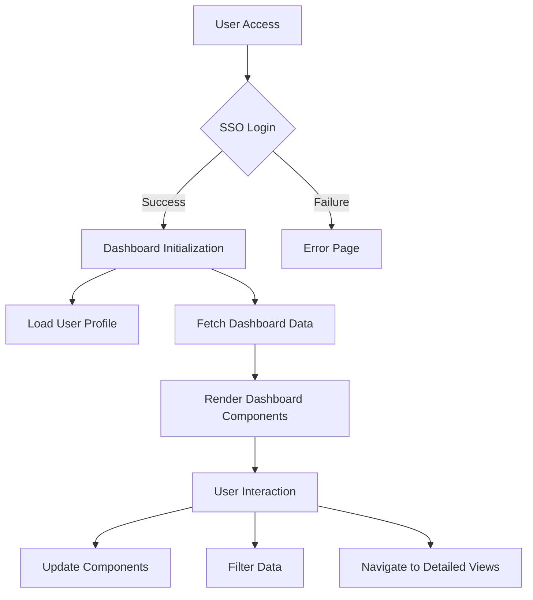
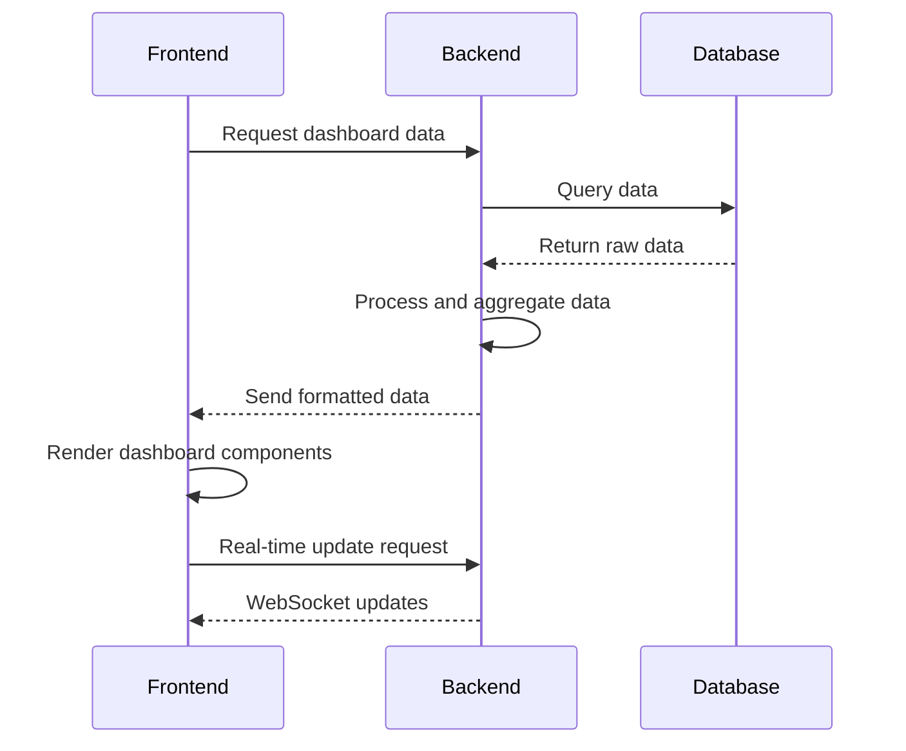

# Customer Data Platform (CDP) Application Design Document

## Page 1: Project Overview and Authentication

### Project Name and Heading

**Project Name: E-Commerce Insights Hub**

*Empowering data-driven decisions through comprehensive customer analytics*

### Google SSO Authentication

The E-Commerce Insights Hub will implement Google Single Sign-On (SSO) authentication using the @react-oauth/google library. This process will ensure secure and seamless access for authorized users.

Authentication Flow:
1. User clicks "Sign in with Google" button on the login page
2. Google OAuth consent screen appears
3. User grants permission
4. Application receives authentication token
5. Backend validates token and creates a session

Error Handling:
- Implement try-catch blocks for API calls
- Display user-friendly error messages for failed authentication attempts
- Log detailed error information for debugging

Security Considerations:
- Use HTTPS for all communications
- Implement token expiration and refresh mechanisms
- Store sensitive data (e.g., tokens) securely using HTTP-only cookies

Authentication Interface Design:
- Minimalist login page with company logo
- Prominent "Sign in with Google" button using Ant Design components
- Empty input fields for email and password (for future non-Google authentication options)

```json
{
  "authEndpoint": "/api/auth/google",
  "tokenValidationEndpoint": "/api/auth/validate",
  "logoutEndpoint": "/api/auth/logout"
}
```

## Page 2: Dashboard Design and Components

### Dashboard Layout and Structure

The dashboard will utilize a responsive 12-column grid system, ensuring optimal display across various device sizes. The layout will consist of:

1. Header:
   - Company logo (left-aligned)
   - User profile and logout button (right-aligned)

2. Main Navigation:
   - Vertical sidebar with collapsible menu items
   - Icons and labels for each menu option

3. Content Area:
   - Occupies the remaining space
   - Contains all data visualization components
   - Implements a card-based layout for individual components

4. Footer:
   - Copyright information
   - Links to documentation and support

Responsive Breakpoints:
- Desktop: 1200px and above (full 12-column layout)
- Tablet: 768px to 1199px (8-column layout)
- Mobile: Below 768px (4-column layout, stacked components)

### Key Dashboard Components and API Mapping

#### a. Key Performance Indicators (KPIs)

Visual Description:
- Four card-style components displaying crucial metrics
- Each card features a large number, descriptive label, and trend indicator

Data Visualization:
- Use Ant Design's Statistic component for number display
- Implement small sparkline charts using Plotly.js for trend visualization

Interactivity:
- Hover effect to highlight the card
- Click to expand and show detailed breakdown

Data Update:
- Real-time updates using WebSocket connection
- Smooth transition animation for changing values

CDP Schema Fields:
- total_lifetime_value
- total_orders
- avg_satisfaction_score
- campaign_response_rate

API Endpoint: `/api/kpis`

```json
{
  "kpiData": [
    {
      "label": "Total Revenue",
      "value": 1000000,
      "trend": 0.05,
      "sparklineData": [900000, 950000, 980000, 1000000]
    },
    {
      "label": "Total Orders",
      "value": 5000,
      "trend": 0.03,
      "sparklineData": [4800, 4900, 4950, 5000]
    },
    {
      "label": "Avg Satisfaction",
      "value": 4.5,
      "trend": 0.02,
      "sparklineData": [4.3, 4.4, 4.45, 4.5]
    },
    {
      "label": "Campaign Response Rate",
      "value": 0.25,
      "trend": -0.01,
      "sparklineData": [0.26, 0.255, 0.252, 0.25]
    }
  ]
}
```

#### b. Customer Segment Distribution (Pie Chart)

Visual Description:
- Interactive pie chart showing customer segments
- Legend with segment names and percentages

Data Visualization:
- Use Plotly.js to create a responsive pie chart
- Implement a color scheme that aligns with the overall design

Interactivity:
- Hover to highlight segment and show detailed information
- Click to filter other dashboard components by selected segment

Data Update:
- Daily updates, with a "Last Updated" timestamp
- Smooth transition for data changes

CDP Schema Fields:
- customer_segment

API Endpoint: `/api/customer_segments`

```json
{
  "segmentData": [
    { "segment": "High Value", "count": 1000 },
    { "segment": "Medium Value", "count": 3000 },
    { "segment": "Low Value", "count": 6000 }
  ],
  "lastUpdated": "2023-05-10T08:00:00Z"
}
```

#### c. Monthly Revenue Trend (Line Chart)

Visual Description:
- Line chart showing revenue trends over the past 12 months
- Y-axis representing revenue, X-axis showing months

Data Visualization:
- Plotly.js line chart with smooth curves
- Include data points for easy reading

Interactivity:
- Hover over data points to see exact values
- Zoom and pan capabilities for detailed exploration

Data Update:
- Monthly updates, with the option to view different time ranges

CDP Schema Fields:
- total_lifetime_value (aggregated monthly)

API Endpoint: `/api/monthly_revenue`

```json
{
  "revenueData": [
    { "month": "2022-05", "revenue": 800000 },
    { "month": "2022-06", "revenue": 820000 },
    // ... (data for all 12 months)
    { "month": "2023-04", "revenue": 1000000 }
  ],
  "lastUpdated": "2023-05-01T00:00:00Z"
}
```

#### d. Top 5 Customers by Lifetime Value (Table)

Visual Description:
- Compact table showing customer details and lifetime value
- Sortable columns for easy comparison

Data Visualization:
- Ant Design Table component for structured data display
- Include customer avatar or placeholder icon

Interactivity:
- Click on column headers to sort
- Click on customer name to view detailed profile

Data Update:
- Real-time updates as customer lifetime values change
- Highlight newly added or changed entries

CDP Schema Fields:
- customer_id, first_name, last_name, total_lifetime_value

API Endpoint: `/api/top_customers`

```json
{
  "topCustomers": [
    {
      "id": 1,
      "name": "John Doe",
      "email": "john@example.com",
      "lifetimeValue": 50000
    },
    // ... (data for top 5 customers)
  ],
  "lastUpdated": "2023-05-10T10:30:00Z"
}
```

#### e. Product Category Performance (Bar Chart)

Visual Description:
- Horizontal bar chart showing performance by product category
- Bars representing revenue or units sold

Data Visualization:
- Plotly.js horizontal bar chart
- Color-coded bars based on performance thresholds

Interactivity:
- Hover to see detailed metrics
- Click to filter other components by selected category

Data Update:
- Weekly updates with option to view different time ranges

CDP Schema Fields:
- favorite_category (aggregated with purchase data)

API Endpoint: `/api/product_category_performance`

```json
{
  "categoryData": [
    { "category": "Electronics", "revenue": 500000, "units": 1000 },
    { "category": "Clothing", "revenue": 300000, "units": 3000 },
    // ... (data for all categories)
  ],
  "lastUpdated": "2023-05-07T00:00:00Z"
}
```

#### f. Customer Satisfaction Score (Gauge Chart)

Visual Description:
- Circular gauge chart showing overall satisfaction score
- Color-coded sections (red, yellow, green) for different satisfaction levels

Data Visualization:
- Plotly.js gauge chart with custom styling
- Numerical display of the current score

Interactivity:
- Hover to see score breakdown
- Click to view detailed satisfaction report

Data Update:
- Real-time updates as new feedback is received
- Smooth animation for score changes

CDP Schema Fields:
- avg_satisfaction_score

API Endpoint: `/api/customer_satisfaction`

```json
{
  "satisfactionScore": 4.2,
  "totalResponses": 1000,
  "breakdown": {
    "5": 400,
    "4": 300,
    "3": 200,
    "2": 50,
    "1": 50
  },
  "lastUpdated": "2023-05-10T11:45:00Z"
}
```

#### g. Churn Risk Distribution (Pie Chart)

Visual Description:
- Pie chart showing distribution of customers by churn risk
- Legend with risk categories and percentages

Data Visualization:
- Plotly.js pie chart with custom color scheme
- Donut style for improved readability

Interactivity:
- Hover to highlight risk category and show customer count
- Click to filter other components by selected risk category

Data Update:
- Daily updates with smooth transitions

CDP Schema Fields:
- churn_risk

API Endpoint: `/api/churn_risk`

```json
{
  "churnData": [
    { "risk": "Low", "count": 5000 },
    { "risk": "Medium", "count": 3000 },
    { "risk": "High", "count": 2000 }
  ],
  "lastUpdated": "2023-05-10T00:00:00Z"
}
```

#### h. RFM Segmentation (Scatter Plot)

Visual Description:
- 3D scatter plot representing Recency, Frequency, and Monetary value
- Each point represents a customer, color-coded by segment

Data Visualization:
- Plotly.js 3D scatter plot
- Implement proper axis scaling for clear distribution

Interactivity:
- Rotate and zoom the 3D plot
- Hover over points to see customer details
- Click to view detailed customer profile

Data Update:
- Weekly updates with option to view different time ranges

CDP Schema Fields:
- days_since_last_purchase (Recency)
- total_orders (Frequency)
- total_lifetime_value (Monetary)

API Endpoint: `/api/rfm_segmentation`

```json
{
  "rfmData": [
    {
      "customerId": 1,
      "recency": 5,
      "frequency": 20,
      "monetary": 5000,
      "segment": "High Value"
    },
    // ... (data for all customers)
  ],
  "lastUpdated": "2023-05-07T00:00:00Z"
}
```

### Dashboard Interactivity and User Experience

1. Global Filtering:
   - Implement a date range picker for time-based filtering
   - Add dropdown filters for customer segments and product categories
   - Apply filters across all relevant components simultaneously

2. Search Functionality:
   - Add a global search bar in the header
   - Enable searching by customer name, email, or ID
   - Implement type-ahead suggestions for efficient searching

3. Cross-component Data Linking:
   - Clicking on a segment in the Customer Segment Distribution chart filters other components
   - Selecting a product category in the Product Category Performance chart updates customer lists and revenue trends

4. Customization Options:
   - Allow users to drag and drop dashboard components to rearrange layout
   - Implement a settings panel for users to choose which KPIs to display
   - Provide options to switch between different chart types (e.g., pie chart to bar chart)

5. Responsive Design:
   - Ensure all components adapt to different screen sizes
   - Implement a collapsible sidebar for mobile views
   - Use Ant Design's responsive grid system for consistent layouts

6. Performance Optimization:
   - Implement lazy loading for off-screen components
   - Use efficient data caching mechanisms to reduce API calls
   - Optimize large datasets by implementing pagination or infinite scrolling

7. Accessibility:
   - Ensure proper keyboard navigation throughout the dashboard
   - Implement ARIA labels and roles for all interactive elements
   - Provide text alternatives for all charts and graphs

By implementing these features and components, the CDP application will provide a comprehensive and user-friendly interface for analyzing customer data and deriving actionable insights.

## Page 3: Architecture Visualization and Technical Considerations

### Sankey Diagram Implementation using Plotly

The Sankey diagram provided represents the data flow in our CDP application, showcasing how data moves from source tables through temporary tables to the final customer_360 view. Here's how to implement and interact with this diagram using Plotly:

1. Data Preparation:
   - Convert the provided JSON structure into Plotly's required format
   - Define nodes and links based on the data flow

2. Plotly Implementation:
```javascript
import Plotly from 'plotly.js-dist';

const data = [{
  type: "sankey",
  orientation: "h",
  node: {
    pad: 15,
    thickness: 30,
    line: { color: "black", width: 0.5 },
    label: ["customer_info", "purchase_transactions", "product_catalog", "customer_service", "campaign_responses", "website_behavior", "temp_basic_info", "temp_purchase_stats", "temp_favorites", "temp_customer_service", "temp_campaign_engagement", "temp_website_behavior", "customer_360"],
    color: ["#a6cee3", "#1f78b4", "#b2df8a", "#33a02c", "#fb9a99", "#e31a1c", "#fdbf6f", "#ff7f00", "#cab2d6", "#6a3d9a", "#ffff99", "#b15928", "#8dd3c7"]
  },
  link: {
    source: [0, 1, 1, 2, 3, 4, 5, 6, 7, 8, 9, 10, 11],
    target: [6, 7, 8, 8, 9, 10, 11, 12, 12, 12, 12, 12, 12],
    value: [1, 1, 1, 1, 1, 1, 1, 1, 1, 1, 1, 1, 1]
  }
}];

const layout = {
  title: "CDP Data Flow",
  font: { size: 10 }
};

Plotly.newPlot('sankey-container', data, layout);
```

3. Styling:
   - Customize colors to match the application's theme
   - Adjust node and link opacity for better visibility

4. Interactivity:
   - Implement hover effects to show detailed information about each node and link
   - Add click events to highlight specific data flows

5. Responsiveness:
   - Use Plotly's responsive features to ensure the diagram adapts to different screen sizes

6. Performance Considerations:
   - Optimize the diagram for large datasets by aggregating less significant flows
   - Implement lazy loading if the diagram is not immediately visible on page load

### Data Integration and Performance

1. Sample Data Generation:
   - Create mock data that adheres to the CDP schema structure
   - Ensure generated data covers all possible scenarios and edge cases

2. Efficient Data Loading:
   - Implement pagination for large datasets
   - Use virtual scrolling for long lists of customers or transactions

3. State Management:
   - Utilize Redux for centralized state management
   - Implement efficient update mechanisms to reflect real-time changes

4. Caching Mechanisms:
   - Use browser local storage for caching static data
   - Implement Redis on the backend for frequently accessed data

5. Error Handling:
   - Develop comprehensive error boundaries in React
   - Create fallback UI components for failed data loads

### Responsive Design and Cross-platform Considerations

1. Breakpoints:
   - Desktop: 1200px and above
   - Tablet: 768px to 1199px
   - Mobile: Below 768px

2. Layout Adjustments:
   - Desktop: Full dashboard with all components visible
   - Tablet: Collapsible sidebar, scrollable dashboard
   - Mobile: Stacked components, expandable/collapsible sections

3. Progressive Enhancement:
   - Ensure core functionality works on all devices
   - Add advanced interactive features for devices with higher capabilities

4. Touch Optimization:
   - Implement larger touch targets for mobile devices
   - Add swipe gestures for navigating between dashboard sections on mobile

5. Performance Optimization:
   - Use code splitting to reduce initial load time on mobile devices
   - Optimize images and assets for different screen resolutions

By following these guidelines, the CDP application will provide a seamless and efficient user experience across various devices and platforms.

## Page 4: Website Flow and API Integration

### Website Flow



1. User Journey:
   - User accesses the application URL
   - SSO login screen is presented
   - Upon successful authentication, user is redirected to the main dashboard
   - Dashboard initializes and loads user-specific data
   - User can interact with various components, apply filters, and navigate to detailed views

2. Authentication to Main Application Transition:
   - After successful SSO login, a loading screen is displayed
   - User profile data is fetched and stored in the application state
   - Dashboard layout is prepared based on user preferences (if available)

3. Dashboard Initialization Process:
   - Skeleton UI is displayed to improve perceived performance
   - Critical data (KPIs, customer segments) is loaded first
   - Less critical components are loaded asynchronously
   - WebSocket connection is established for real-time updates

4. User Interactions Within Dashboard:
   - Global filters affect all relevant components simultaneously
   - Clicking on chart elements updates related components
   - Detailed views are loaded on-demand to optimize performance

### API Integration



API Endpoints and Data Fetching:

1. KPIs: `/api/kpis`
   - Fetches aggregated data for key performance indicators
   - Updates in real-time via WebSocket

2. Customer Segments: `/api/customer_segments`
   - Retrieves customer segment distribution
   - Updates daily, with caching for improved performance

3. Monthly Revenue: `/api/monthly_revenue`
   - Fetches revenue data for the past 12 months
   - Implements date range parameters for flexible querying

4. Top Customers: `/api/top_customers`
   - Retrieves data for top 5 customers by lifetime value
   - Updates in real-time, with optimistic UI updates

5. Product Category Performance: `/api/product_category_performance`
   - Fetches performance data for each product category
   - Allows filtering by date range and category

6. Customer Satisfaction: `/api/customer_satisfaction`
   - Retrieves overall satisfaction score and breakdown
   - Updates in real-time as new feedback is received

7. Churn Risk: `/api/churn_risk`
   - Fetches distribution of customers by churn risk
   - Updates daily, with trend analysis over time

8. RFM Segmentation: `/api/rfm_segmentation`
   - Retrieves RFM (Recency, Frequency, Monetary) data for all customers
   - Implements pagination for efficient loading of large datasets

### Data Refresh and Real-time Updates

1. Keeping Dashboard Data Current:
   - Implement a combination of pull-based and push-based updates
   - Use WebSockets for real-time updates on critical metrics (KPIs, satisfaction scores)
   - Set up periodic polling for less time-sensitive data (monthly trends, segment distributions)

2. Real-time Update Implementation:
   - Establish WebSocket connection on dashboard initialization
   - Listen for specific event types (e.g., 'kpi_update', 'new_customer')
   - Update relevant components without full page refresh

3. Optimistic Updates:
   - Implement optimistic UI updates for user actions (e.g., changing customer segment)
   - Revert changes if server update fails, ensuring data consistency

4. Caching and Performance:
   - Utilize browser caching for static assets and infrequently changing data
   - Implement server-side caching (e.g., Redis) for frequently accessed data
   - Use ETags and conditional requests to minimize unnecessary data transfer

5. Error Handling and Retry Mechanisms:
   - Implement exponential backoff for failed API requests
   - Provide clear error messages and retry options for users
   - Log errors on the server-side for monitoring and debugging

By implementing this comprehensive API integration and real-time update strategy, the CDP application will provide users with up-to-date, accurate data while maintaining optimal performance and user experience.

# Customer Compass 360 Backend API Documentation

## Overview

This document provides detailed information about the backend API for the Customer Compass 360 application. The API is built using FastAPI and provides various endpoints to retrieve customer data, performance metrics, and visualizations.

## Base URL

The base URL for all API endpoints will depend on your deployment environment. Replace `{BASE_URL}` in the endpoint URLs with the appropriate base URL for your deployment.

## Authentication

Currently, the API does not implement authentication. If required, authentication mechanisms should be added before deploying to a production environment.

## Endpoints

### 1. Root

- **URL:** `{BASE_URL}/`
- **Method:** GET
- **Description:** Provides a welcome message for the API.
- **Response:**
  ```json
  {
    "message": "Welcome to the CDP Dashboard API"
  }
  ```

### 2. Key Performance Indicators (KPIs)

- **URL:** `{BASE_URL}/kpis`
- **Method:** GET
- **Description:** Retrieves key performance indicators for the business.
- **Response:** JSON object containing:
  - `total_customers`: Integer representing the total number of customers
  - `total_lifetime_value`: Float representing the total lifetime value of all customers
  - `average_order_value`: Float representing the average order value of all customers
  - `retention_rate`: Float representing the retention rate of all customers (percentage)
- **Example Response:**
  ```json
  {
    "total_customers": 10000,
    "total_lifetime_value": 5000000.50,
    "average_order_value": 150.75,
    "retention_rate": 85.5
  }
  ```

### 3. Customer Segments

- **URL:** `{BASE_URL}/customer_segments`
- **Method:** GET
- **Description:** Retrieves customer segment distribution data.
- **Response:** JSON object representing a pie chart of customer segment distribution.
- **Note:** The response is a Plotly figure JSON that can be used to render a chart on the frontend.

### 4. Monthly Revenue

- **URL:** `{BASE_URL}/monthly_revenue`
- **Method:** GET
- **Description:** Retrieves monthly revenue trend data.
- **Response:** JSON object representing a line chart of monthly revenue trend.
- **Note:** The response is a Plotly figure JSON that can be used to render a chart on the frontend.

### 5. Top Customers

- **URL:** `{BASE_URL}/top_customers`
- **Method:** GET
- **Description:** Retrieves the top 5 customers by total lifetime value.
- **Response:** JSON array of objects, each containing:
  - `customer_id`: String representing the customer's unique identifier
  - `first_name`: String representing the customer's first name
  - `last_name`: String representing the customer's last name
  - `total_lifetime_value`: Float representing the customer's total lifetime value
- **Example Response:**
  ```json
  [
    {
      "customer_id": "C001",
      "first_name": "John",
      "last_name": "Doe",
      "total_lifetime_value": 25000.50
    },
    {
      "customer_id": "C002",
      "first_name": "Jane",
      "last_name": "Smith",
      "total_lifetime_value": 22000.75
    }
  ]
  ```

### 6. Product Category Performance

- **URL:** `{BASE_URL}/product_category_performance`
- **Method:** GET
- **Description:** Retrieves revenue performance data for different product categories.
- **Response:** JSON object representing a bar chart of product category performance.
- **Note:** The response is a Plotly figure JSON that can be used to render a chart on the frontend.

### 7. Customer Satisfaction

- **URL:** `{BASE_URL}/customer_satisfaction`
- **Method:** GET
- **Description:** Retrieves the average customer satisfaction score.
- **Response:** JSON object representing a gauge chart of customer satisfaction score.
- **Note:** The response is a Plotly figure JSON that can be used to render a chart on the frontend.

### 8. Churn Risk

- **URL:** `{BASE_URL}/churn_risk`
- **Method:** GET
- **Description:** Retrieves the distribution of churn risk scores.
- **Response:** JSON object representing a pie chart of churn risk distribution.
- **Note:** The response is a Plotly figure JSON that can be used to render a chart on the frontend.

### 9. RFM Segmentation

- **URL:** `{BASE_URL}/rfm_segmentation`
- **Method:** GET
- **Description:** Retrieves RFM (Recency, Frequency, Monetary) segmentation data.
- **Response:** JSON object representing a 3D scatter plot of RFM segmentation.
- **Note:** The response is a Plotly figure JSON that can be used to render a chart on the frontend.

## Error Handling

All endpoints will return appropriate HTTP status codes:
- 200: Successful request
- 4xx: Client errors (e.g., 404 for not found, 400 for bad request)
- 5xx: Server errors

In case of errors, a JSON object with an "error" key describing the issue will be returned.

Example error response:
```json
{
  "error": "Resource not found"
}
```

## Data Format

All responses are in JSON format. For endpoints returning chart data (customer segments, monthly revenue, product category performance, customer satisfaction, churn risk, and RFM segmentation), the response is a JSON representation of a Plotly figure, which can be directly used to render charts on the frontend.

## Database

The API interacts with an SQLite database named `pg_cdp_demo.db`. This database contains the following tables:
- `customer_360`: Contains comprehensive customer data
- `purchase_transactions`: Contains data about customer purchases
- `product_catalog`: Contains information about products

## Dependencies

The backend relies on the following main Python libraries:
- FastAPI: Web framework for building the API
- SQLite3: Database interaction
- Pandas: Data manipulation and analysis
- Plotly: Generating interactive charts
- Anthropic: For potential AI-powered features (API key required)

## Running the API

To run the API locally:

1. Ensure all dependencies are installed:
   ```
   pip install fastapi uvicorn sqlite3 pandas plotly
   ```

2. Run the FastAPI application using Uvicorn:
   ```
   uvicorn main:app --host 0.0.0.0 --port 8000
   ```

The API will be available at `http://localhost:8000`. You can access the interactive API documentation at `http://localhost:8000/docs`.

## Deployment

For production deployment, consider the following:
- Use a production-grade ASGI server like Gunicorn with Uvicorn workers
- Implement proper authentication and authorization mechanisms
- Use environment variables for sensitive information (e.g., database credentials)
- Consider using a production-ready database system (e.g., PostgreSQL)
- Implement HTTPS for secure communication
- Set up proper logging and monitoring

## Conclusion

This API provides a comprehensive set of endpoints to retrieve various customer and business metrics for the Customer Compass 360 application. It's designed to be easily integrated with a frontend application to create a full-featured customer data platform dashboard.